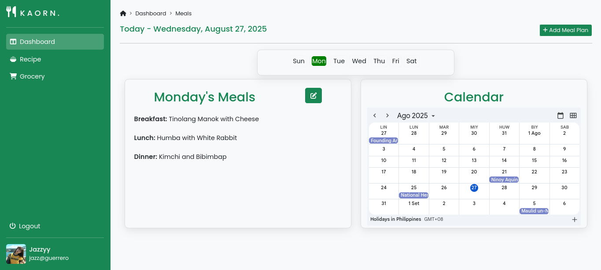

# Kaorn Design Meal Planner Web App

## Overview
Kaorn Design is a web-based meal planner application designed to help users organize their weekly meals efficiently. The app features a user-friendly interface for both regular users and administrators, allowing easy management of recipes, users, and meal schedules.

## Features
- **User Dashboard:** Plan meals for each day of the week.
- **Admin Panel:** Manage recipes and users.
- **Authentication:** Login and signup pages for secure access.
- **Visuals:** Includes engaging images and GIFs to enhance user experience.

## Folder Structure
- `Admin/` — Admin dashboard, recipe management, user management, assets, and styles.
- `Users/` — User dashboard, daily meal planning pages, authentication pages, assets, and styles.

## Screenshots & Images
Below are screenshots of the login page and user interface:

### Login Page


### User Interface


Additional images and GIFs are included in the `assets/images/` folders under both `Admin` and `Users` directories.

## Getting Started
1. Clone the repository:
	```bash
	git clone https://github.com/danskie09/Kaorn-Design.git
	```
2. Open the project in your preferred web server or directly in your browser.
3. Explore the `Admin` and `Users` folders for different functionalities.

## Technologies Used
- HTML5
- CSS3
- JavaScript (if applicable)

## Contributing
Feel free to fork the repository and submit pull requests for improvements or new features.

## License
This project is licensed under the MIT License.
